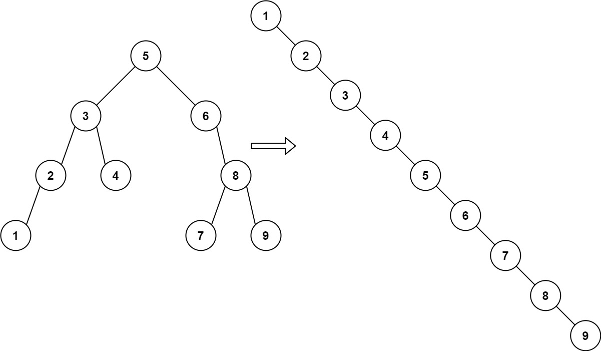

# leet-dec-challenge 
[leetcode](https://leetcode.com/explore/challenge/card/december-leetcoding-challenge/)  
This repo contains solution to the problems in LeetCode December Challenge.

# About the challenge
This Challenge is beginner-friendly and available to both Premium and non-Premium users. It consists of 31 daily problems over the month of December. A problem is added here each day, and you have 24 hours to make a valid submission for it in order to be eligible for rewards.
## Day 1
+ Problem link [link](https://leetcode.com/explore/challenge/card/december-leetcoding-challenge/569/week-1-december-1st-december-7th/3551/)
+ Given the root of a binary tree, return its maximum depth.
+ A binary tree's maximum depth is the number of nodes along the longest path from the root node down to the farthest leaf node.
+ Example 1:  
  
 ```
 Input: root = [3,9,20,null,null,15,7]
 Output: 3
 ```
+ Example 2:
```
Input: root = [1,null,2]
Output: 2
```
+ Constraints:  
  * The number of nodes in the tree is in the range [0, 104].
  * -100 <= Node.val <= 100
## Day 2
+ Problem link [link](https://leetcode.com/explore/challenge/card/december-leetcoding-challenge/569/week-1-december-1st-december-7th/3552/)
+ Given a singly linked list, return a random node's value from the linked list. Each node must have the same probability of being chosen.
+ Example:
```
// Init a singly linked list [1,2,3].
ListNode head = new ListNode(1);
head.next = new ListNode(2);
head.next.next = new ListNode(3);
Solution solution = new Solution(head);

// getRandom() should return either 1, 2, or 3 randomly. Each element should have equal probability of returning.
solution.getRandom();
```
## Day3
+ Problem link [link](https://leetcode.com/explore/challenge/card/december-leetcoding-challenge/569/week-1-december-1st-december-7th/3553/)
+ Given the root of a binary search tree, rearrange the tree in in-order so that the leftmost node in the tree is now the root of the tree, and every node has no left child and only one right child.
+ Example 1:  

```
Input: root = [5,3,6,2,4,null,8,1,null,null,null,7,9]
Output: [1,null,2,null,3,null,4,null,5,null,6,null,7,null,8,null,9]
```
+ Example 2:

```
Input: root = [5,1,7]
Output: [1,null,5,null,7]
```
+ Constraints:
    * The number of nodes in the given tree will be in the range [1, 100].
    * 0 <= Node.val <= 1000
